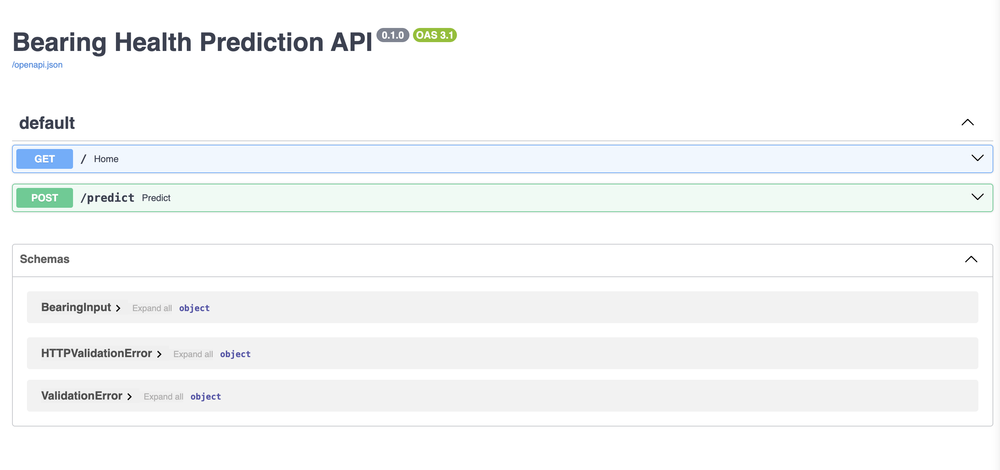
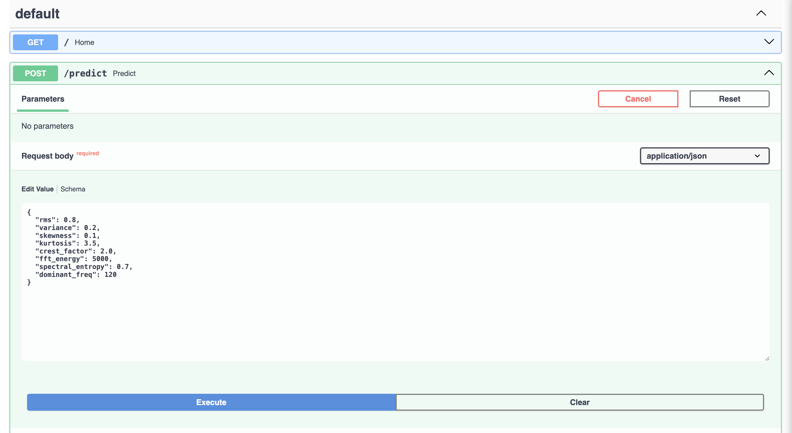
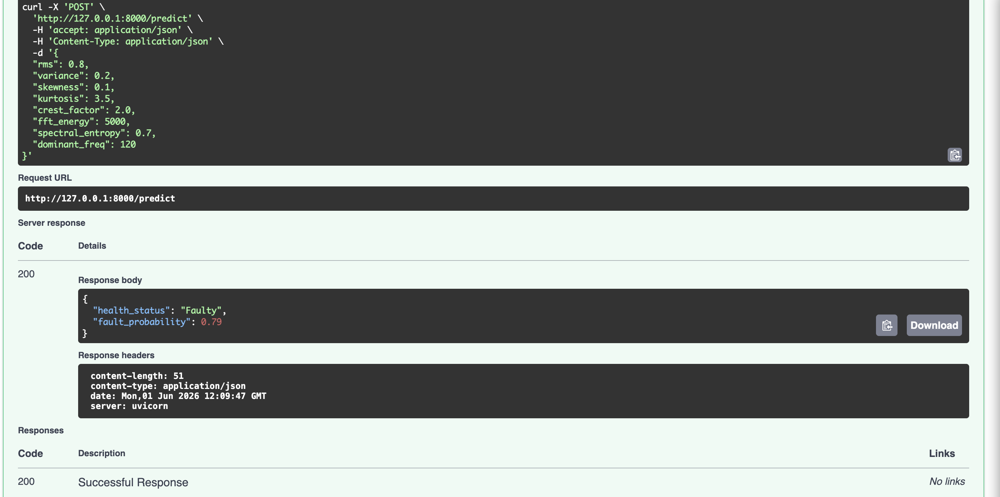

Predictive Maintenance Using Bearing Fault Diagnosis

Overview:
This project focuses on predictive maintenance using machine learning techniques for bearing fault diagnosis across multiple industrial datasets. The study combines feature engineering, exploratory data analysis (EDA), and classification models to identify bearing health conditions and evaluate cross-domain generalization.

The primary objective is to develop a scalable and reliable fault diagnosis pipeline capable of identifying bearing conditions using statistical vibration features extracted from sensor signals.

Problem Statement:

Industrial rotating machinery relies heavily on rolling element bearings for efficient operation. Unexpected bearing failures can result in:
Production downtime
Increased maintenance costs
Equipment damage
Safety risks

Traditional maintenance approaches such as reactive and preventive maintenance are often inefficient because they either respond after a failure occurs or rely on fixed maintenance schedules.

This project aims to develop an intelligent predictive maintenance framework capable of detecting bearing faults at an early stage through vibration signal analysis and machine learning.

Objectives:
Perform vibration signal preprocessing and feature extraction
Conduct exploratory data analysis (EDA) on bearing datasets
Compare time-domain and frequency-domain vibration features
Train machine learning models for bearing fault classification
Evaluate cross-domain generalization performance
Identify the most important features contributing to fault diagnosis

Research Questions:

RQ1: Can a machine learning model trained on one bearing dataset accurately predict faults on another dataset with different operating conditions?

RQ2: Which statistical vibration features contribute most to accurate bearing fault prediction across multiple datasets?

RQ3: Do frequency-domain features detect faults earlier than time-domain features?

RQ4: Do machine learning models outperform traditional threshold-based methods for fault detection in IMS data?


Datasets Used

IMS Bearing Dataset:
The IMS dataset contains run-to-failure bearing vibration signals collected from rotating machinery under controlled operating conditions.
XJTU-SY Bearing Dataset:
A widely used benchmark dataset for intelligent fault diagnosis and predictive maintenance research.

Feature Engineering:

Time-Domain Features:

Mean
Standard Deviation
RMS (Root Mean Square)
Variance
Skewness
Kurtosis
Crest Factor
Frequency-Domain Features:

Spectral Entropy
Dominant Frequency
FFT-Based Statistical Features


Project Workflow:

Experimental Results:


Model Output;


API Response Example


Project Structure:

```
predictive-maintenance/
├── data/
│   ├── ims_features.csv
│   ├── ims_features_crossdomain.csv
│   └── xjtu.csv
│
├── images/
│   ├── API.png
│   ├── OP.png
│   └── OP1.png
│
├── notebooks/
│   └── Cross_domain_Predictive_Maintenance_System_for_Industrial_AI_Fast_API.ipynb
│
├── README.md
└── requirements.txt
```

Key Findings:

Statistical vibration features are highly effective for bearing fault diagnosis.
Time-domain features generally outperform frequency-domain features.
Random Forest achieved near-perfect classification performance on the XJTU dataset.
Cross-domain evaluation highlights challenges in model generalization across different operating conditions.
Feature engineering significantly improves predictive performance.


Applications:


This project can be applied in:
Manufacturing Industries
Smart Factories
Industrial IoT Systems
Rotating Machinery Monitoring
Aerospace Maintenance
Automotive Predictive Maintenance
Energy and Power Plants


Future Scope:


Potential future improvements include:
Deep Learning-based fault diagnosis
Transfer Learning for domain adaptation
Real-time predictive maintenance systems
Edge AI deployment for industrial monitoring
Explainable AI (XAI) for fault interpretation
Streaming sensor data integration


Technologies Used:


Python
NumPy
Pandas
Scikit-learn
SciPy
Matplotlib
FastAPI
Jupyter Notebook

Author:

Yadnikee Bhole

Data Science | Machine Learning | Predictive Maintenance Research
License
